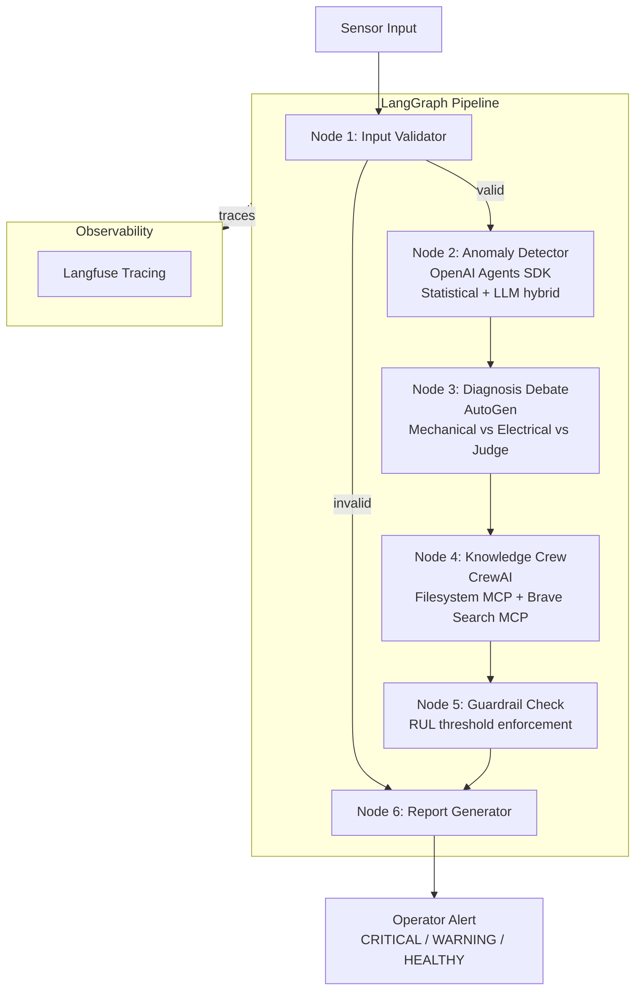

# Multi-Agent Predictive Maintenance System

An end-to-end agentic AI pipeline for industrial turbofan engine health monitoring 
and predictive maintenance, built on NASA CMAPSS dataset.

## Architecture Diagram


## Frameworks & Tools

| Component | Technology |
|-----------|-----------|
| Orchestration | LangGraph |
| Multi-agent diagnosis | AutoGen (RoundRobinGroupChat) |
| Knowledge retrieval | CrewAI + MCP |
| Anomaly detection | OpenAI Agents SDK |
| External tools | Filesystem MCP, Brave Search MCP |
| Observability | Langfuse |
| Dataset | NASA CMAPSS FD001 |

## Results

| Metric | Value |
|--------|-------|
| Evaluation accuracy | 9/9 (100%) |
| Risk zones tested | CRITICAL, WARNING, HEALTHY |
| Engines tested | 3 different engines |
| Avg pipeline latency | ~99 seconds |

## Project Structure
```
predictive-maintenance-agent/
├── data/
│   └── manuals/          # Local maintenance manuals (MCP filesystem)
├── notebooks/
│   ├── eda_FD001.ipynb   # Exploratory data analysis
│   └── evaluation.ipynb  # Pipeline evaluation results
├── src/
│   ├── agent_modules/
│   │   ├── anomaly_detector.py    # OpenAI Agents SDK
│   │   ├── diagnosis_agents.py    # AutoGen debate
│   │   └── knowledge_crew.py      # CrewAI + MCP
│   ├── pipeline/
│   │   ├── pipeline.py            # LangGraph pipeline
│   │   ├── test_pipeline.py       # Single test case
│   │   └── evaluate_pipeline.py   # Full evaluation
│   └── schemas/
│       ├── pipeline_state.py      # LangGraph state definition
│       ├── sensor_config.json     # Sensor configuration & thresholds
│       └── sensor_baselines.json  # Healthy baseline values from EDA
├── docs/
│   ├── evaluation_results.json    # Evaluation results
│   └── evaluation_results.png     # Evaluation plots
├── DESIGN.md                      # Architecture & design decisions
└── requirements.txt
```

## Setup

### Prerequisites
- Python 3.11+
- Node.js 20+ (for MCP servers)
- uv package manager

### Installation
```bash
# Clone the repository
git clone https://github.com/HalimehAgh/predictive-maintenance-agent
cd predictive-maintenance-agent

# Install dependencies
uv venv
source .venv/bin/activate
uv sync

# Install MCP servers
npx -y @modelcontextprotocol/server-filesystem
npx -y @modelcontextprotocol/server-brave-search
```

### Environment Variables

Create a `.env` file:
```
OPENAI_API_KEY=your_key_here
BRAVE_API_KEY=your_key_here
LANGFUSE_PUBLIC_KEY=your_key_here
LANGFUSE_SECRET_KEY=your_key_here
LANGFUSE_HOST=https://cloud.langfuse.com
```

### Dataset

Download NASA CMAPSS dataset and place in `data/`:
- `train_FD001.txt`
- `test_FD001.txt`  
- `RUL_FD001.txt`

Download: https://data.nasa.gov/dataset/cmapss-jet-engine-simulated-data

### Run
```bash
# Single test case
uv run python src/pipeline/test_pipeline.py

# Full evaluation (9 cases)
uv run python src/pipeline/evaluate_pipeline.py
```

## Design Decisions

See [DESIGN.md](DESIGN.md) for detailed rationale on framework selection, 
guardrail design, and MCP integration strategy.

## Observability

All agent interactions are traced via Langfuse. Each pipeline run produces:
- Full LangGraph trace with per-node latency
- AutoGen debate transcript as nested spans
- CrewAI crew execution trace
- Anomaly detection statistical + LLM spans

## Future Work

- [ ] FastAPI serving layer for REST API access
- [ ] Docker containerization
- [ ] Kubernetes deployment manifests
- [ ] Support for FD002-FD004 (multi-condition datasets)
- [ ] Real-time streaming sensor input